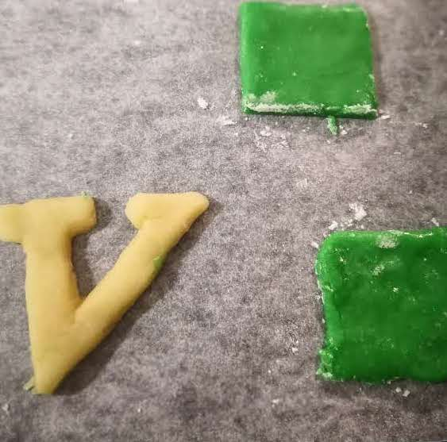
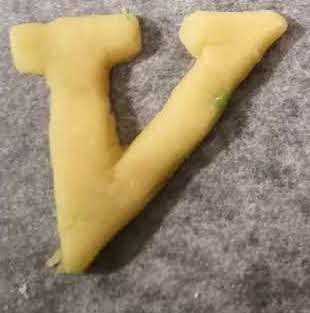
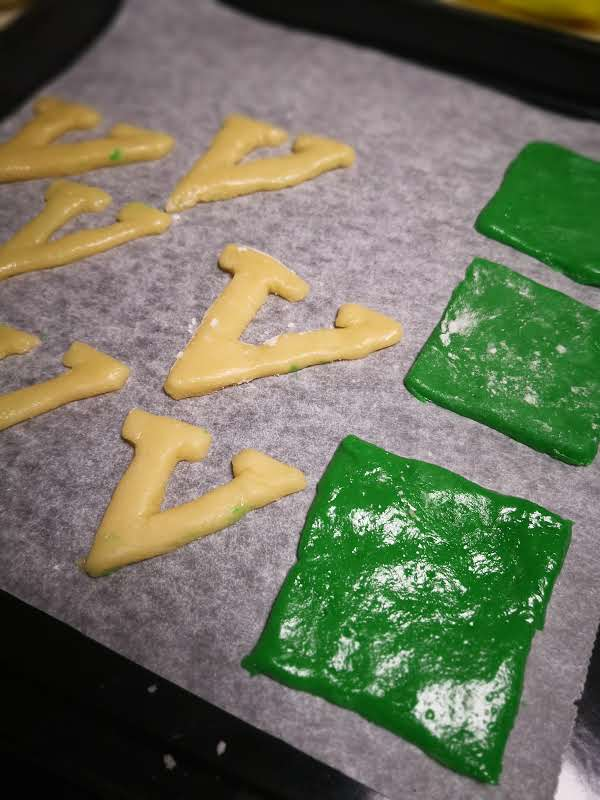
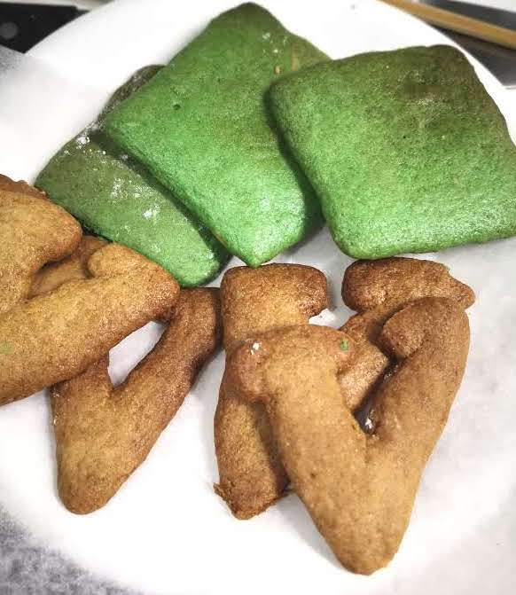
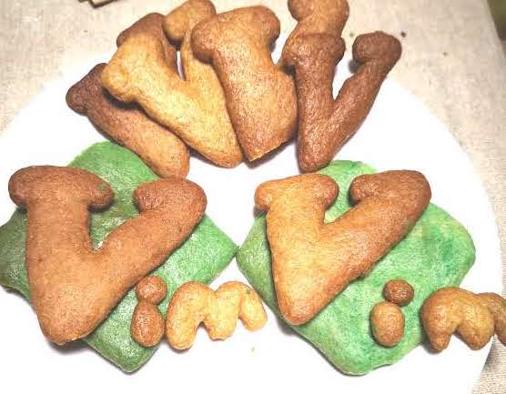
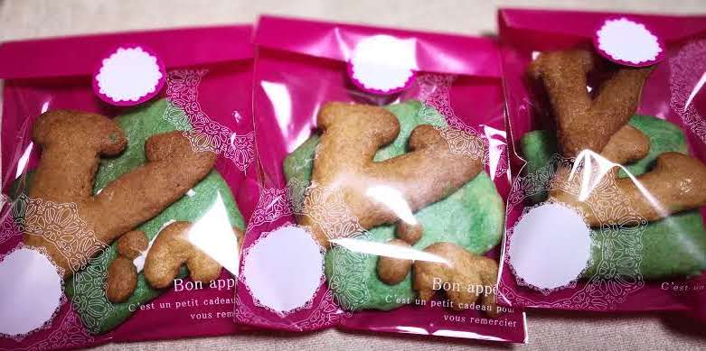

# Vimmer必見！Vimクッキーの作り方
私はVimmerで少し前からVimのロゴのクッキーを作ってVimmerにあげたいと思ってたので、作ってみました。

## 作り方

### 材料

|名前|分量|用途|
|-|-|-|
|ホットケーキミックス|150g|生地|
| 食用色素　緑 |少々|生地の色付け|
|砂糖|大さじ4|生地|
|サラダ油|大さじ4|生地|
|卵白|一個分|生地|
|片栗粉|大さじ1|形にする時くっつかないように|
|マシュマロ|3つくらい|クッキーとクッキーをくっつける|

### 必要な道具・もの

|名前|用途|
|-|-|
|ボウル|材料を混ぜて生地を作る|
|ゴムベラ|材料を混ぜて生地を作る|
|泡立て器(混ぜられればなんでも)|材料を混ぜて生地を作る|
|クッキングシート|形にした生地をのせる|
|麺棒（あれば）|生地を平らにする|
|ナイフ(包丁でもなんでも)|生地を形にする|
|オーブン（電子オーブン可）|生地を焼く|

### 工程

1. 糖、サラダ油、卵白をボウルに入れ、泡立て器でよくかき混ぜておく。
1. そのボウルに、ホットケーキミックスを入れ、ゴムベラで混ぜる。
1. しっかり混ざったら、生地を2:1くらいに分け、2の方に、食用色素　緑をちょうど良い色になるまで入れる。

#### 緑の正方形のクッキー

1. 緑色の生地を、ナイフで切り、5cmの正方形にする。

#### Vのクッキー
1. 高さが7cmになるように、Vの形にナイフで切る。（やりにくい、、）時間があるなら型を作ることをお勧めします。

1. iとmも適当な大きさで作りましょう。

#### 焼く
1. オーブンで、170度、12~15分焼く。

#### 仕上げ
1.マシュマロと少しの水を入れて、 電子レンジで、20秒する。
1. ロゴの絵を見ながら、適当な場所に溶かしたマシュマロを接着剤代わりにして、くっつける。

出来上がり！！

